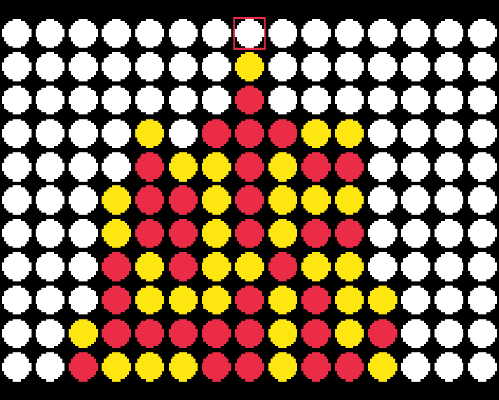

# ConnectX

A single-device, multiplayer Connect 4 variant built for Sprig Consoles. 

Written in JavaScript using the **[Sprig Online Editor](https://sprig.hackclub.com/editor)**. See the source code for ConnectX **[here](https://github.com/siddhp1/ConnectX/blob/main/games/ConnectX.js)**.

## About

The game consists of 10 rounds, from Connect 3 to Connect 12. The player that takes the most rounds wins the game!

## Usage

Follow **[these instructions](https://github.com/siddhp1/ConnectX/blob/main/docs/UPLOAD.md)** to play ConnectX on your Sprig Console.

Visit the ConnectX **[Gallery Page](https://sprig.hackclub.com/gallery/play/ConnectX)** to play ConnectX online.

## License

This project is licensed under the MIT License.
